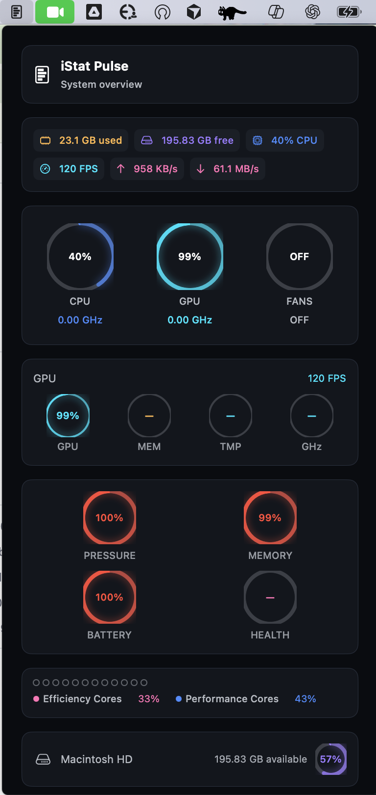
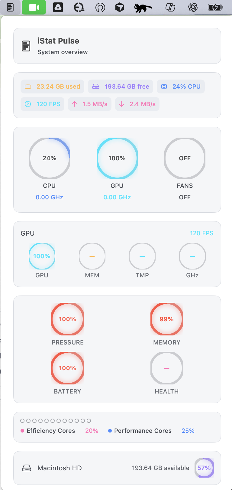
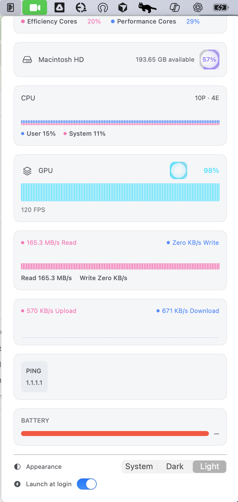

# iStat Pulse

**macOS menu bar system monitor** — CPU, GPU, memory, disk, network, battery, and sensors in a compact popover with circular gauges and real-time mini graphs.

---

## Purpose

iStat Pulse provides **at-a-glance system metrics** in the menu bar, inspired by iStat Menus. It uses a **single refresh engine** (no per-metric timers), **GPU-accelerated** mini graphs (SwiftUI Canvas), and **threshold-based colors** with smooth animations. Built for **low footprint** and **graceful failures** (e.g. no battery on desktop, SMC unavailable in sandbox).

---

## Features

| Area | What it does |
|------|----------------|
| **CPU** | Usage %, P/E-core split (Apple Silicon), frequency, package temp (SMC); per-core deltas via `host_processor_info` |
| **GPU** | Utilization, frequency, temperature (IORegistry + SMC); FPS via CVDisplayLink |
| **Memory** | Pressure % (vm_statistics64 + swap); wired, compressed, swap in subtitle |
| **Disk** | Usage %, read/write throughput (1s rolling); root volume from getfsstat, IO from IOKit |
| **Network** | Per-interface ↓/↑ B/s (delta from getifaddrs); optional ICMP ping (configurable host) |
| **Battery** | %, health, cycle count, charge rate, time remaining (IOPowerSources) |
| **Sensors** | Thermals + fans (AppleSMC: TC0P, TG0P, F0Ac, etc.) |
| **UI** | Global summary bar, circular gauges (rounded caps, gradient, glow), 60–120 sample mini graphs, P/E core line, launch-at-login, permission hints |

---

## Screenshots

Add images under `docs/images/` and keep the names below.

| View | Preview |
|------|---------|
| Popover (dark) |  |
| Popover (dark) |  |
| Popover (light) |  |
| Popover (light) |  |

---

## Requirements

- **macOS 15.6+** (Xcode 16+, Swift 5)
- **Architecture:** Apple Silicon or Intel (arm64 / x86_64)

---

## Installation

1. **Clone**
   ```bash
   git clone https://github.com/<your-username>/iStatPulse.git
   cd iStatPulse
   ```
2. **Open** `iStatPulse.xcodeproj` in Xcode.
3. **Build & Run** (⌘R). The app appears in the **menu bar** (no dock icon).
4. **Optional:** Enable **Launch at login** from the popover footer.

---

## Usage

- **Click the menu bar icon** → popover opens with all metrics.
- **Global summary bar** shows CPU %, network ↓/↑, and ping (if available).
- **Each row:** icon, title, circular gauge, value, mini graph (when history exists), subtitle.
- **Footer:** Launch at login toggle; sensors-unavailable hint when SMC is restricted (e.g. sandbox).

---

## Architecture

```
┌─────────────────────────────────────────────────────────┐
│  Popover (SwiftUI)                                      │
│  • PopoverContentView ← PopoverViewModel               │
│  • MetricRow = CircularGauge + MiniGraphView + caption  │
└───────────────────────────┬─────────────────────────────┘
                            │
┌───────────────────────────▼─────────────────────────────┐
│  SystemMetricsService (Combine)                          │
│  • Single RefreshEngine (1 timer, configurable interval) │
│  • On tick → refresh() all Refreshable services          │
│  • combineLatest(cpu, memory, disk, gpu, network,        │
│                  battery, sensors) → SystemMetrics       │
└───────────────────────────┬─────────────────────────────┘
                            │
┌───────────────────────────▼─────────────────────────────┐
│  Services (Refreshable)                                  │
│  CPU, Memory, Disk, GPU, Network, Battery, SMCSensors   │
│  • host_processor_info, vm_statistics64, getfsstat,      │
│    IOKit, IOPowerSources, AppleSMC, getifaddrs, Ping     │
└─────────────────────────────────────────────────────────┘
```

- **One timer** → backpressure (next tick only after current refresh completes).
- **Off main thread** → refresh runs on a serial queue; UI updates on main via Combine.

---

## Project Structure

| Path | Role |
|------|------|
| `iStatPulse/AppDelegate.swift` | NSStatusItem + NSPopover; menu bar entry point |
| `iStatPulse/Views/PopoverContentView.swift` | Main UI: header, global summary, metric sections, footer |
| `iStatPulse/Views/Components/` | `CircularGauge.swift`, `MiniGraphView.swift` |
| `iStatPulse/ViewModels/PopoverViewModel.swift` | Binds SystemMetricsService + sample buffers; launch-at-login, capabilities |
| `iStatPulse/Theme/AppTheme.swift` | Palette, threshold levels, semantic colors, gauge/graph constants |
| `iStatPulse/Models/` | `SystemMetrics.swift`, `SampleBuffer.swift`, `SystemCapabilities.swift` |
| `iStatPulse/Services/` | **RefreshEngine**, CPU, Memory, Disk, GPU, Network, Battery, SMCSensors, FPSSampler, Ping, VolumeSpace, DiskIOStats, InterfaceStatsReader, SwapUsage, Sysctl, SMC thermal, LaunchAtLogin |

---

## Tech Stack

- **UI:** SwiftUI, AppKit (NSStatusItem, NSPopover)
- **Data:** Combine (Publishers, Subjects, combineLatest)
- **System APIs:** IOKit, IOPowerSources, Mach (host_processor_info, host_statistics64), sysctl, getifaddrs, getfsstat, SOCK_DGRAM ICMP, CVDisplayLink
- **Refresh:** Single `RefreshEngine` (DispatchSourceTimer, serial queue); all metrics driven by one tick

---

## Verification

See **[VERIFICATION.md](VERIFICATION.md)** for:

- Layout vs. iStat Menus reference (vertical modules, spacing, hierarchy)
- Semantic colors and threshold-based transitions
- Checklist: gauges (rounded caps, stroke, background, animation), graphs (60–120 samples, left-to-right)
- Data sources: CPU/GPU/memory/disk/network/battery/refresh engine
- How to validate against Activity Monitor, iStat Menus, iostat, and Instruments

---

## Contributing

Contributions are welcome. Open an issue or a pull request; keep changes aligned with the existing architecture (single refresh engine, Combine, SwiftUI).

---

## License

See the repository’s license file. If none exists, add one (e.g. MIT).
